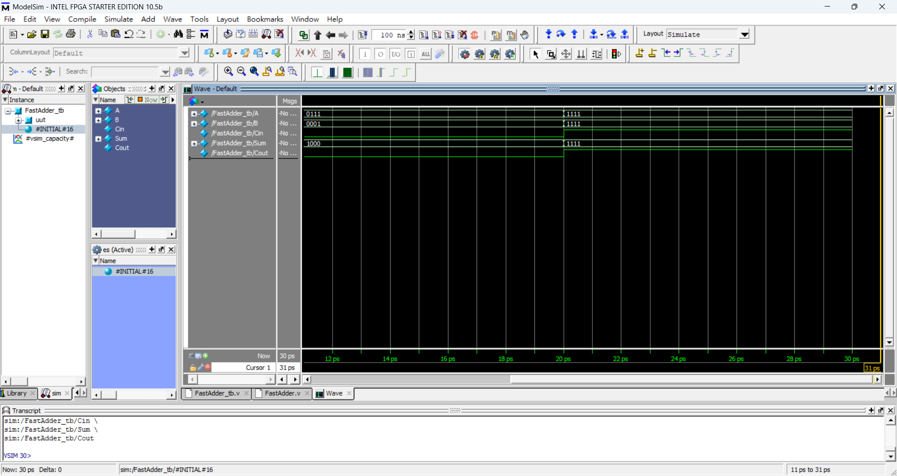
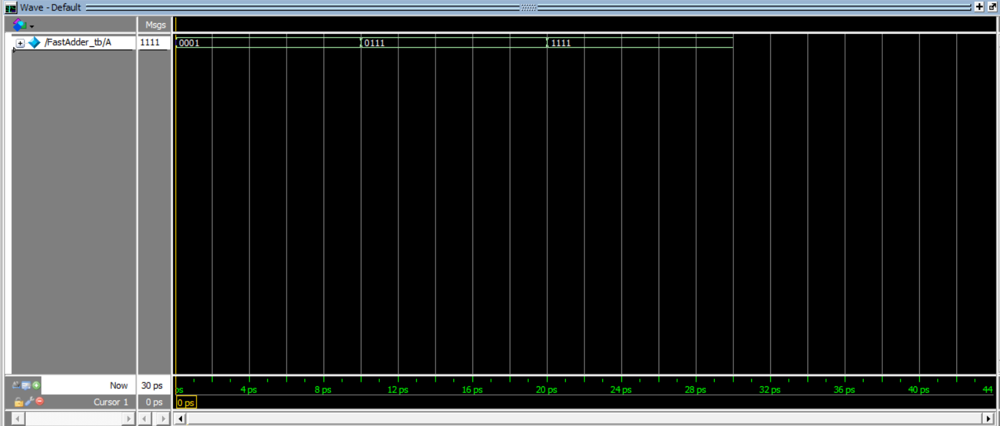
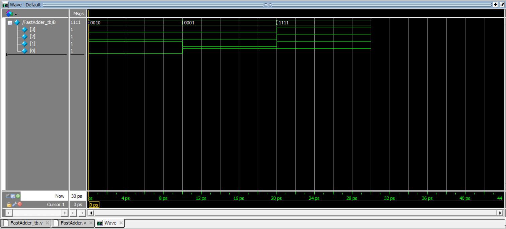
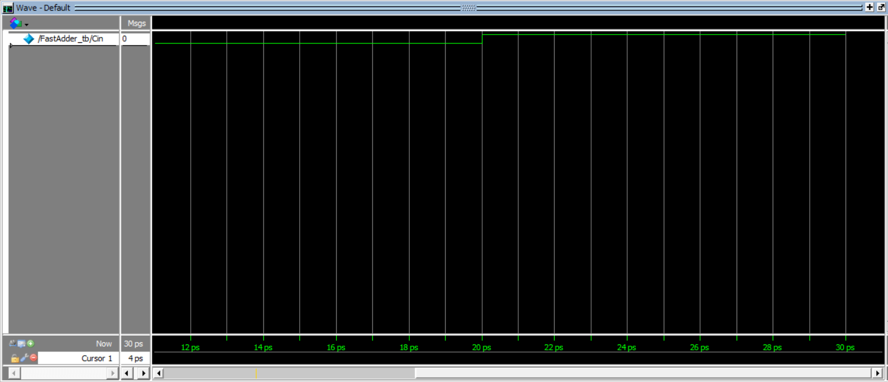
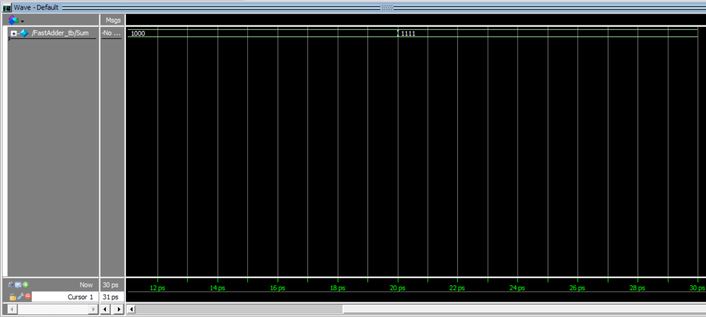
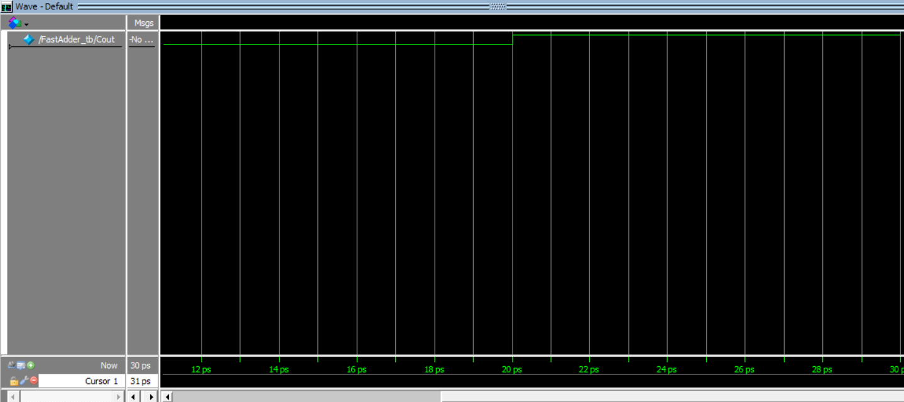

# 快速加法器波形模擬|學習筆記

## 簡介
快速加法器（FastAdder）是一種高效的電路，用於執行二進制加法。本次作業目的是學習如何設計、實現並測試快速加法器模組，使用 Verilog 語言在 Quartus 環境中完成波形模擬。

## 學習目標

1. 實現一個快速加法器，對兩個二進位數進行加法運算。
2. 學習使用Quartus進行波形模擬。

## 設計說明

- **輸入**：
  - `A`：n 位二進制輸入。
  - `B`：n 位二進制輸入。
  - `Cin`：進位輸入位。
- **輸出**：
  - `Sum`：n 位和輸出。
  - `Cout`：進位輸出位。
- **位寬**：位寬(n)為參數化，默認為4位。

## Verilog 實現

以下是快速加法器模組的 Verilog 代碼：

```verilog
module FastAdder #(parameter WIDTH = 4) (
    input [WIDTH-1:0] A,
    input [WIDTH-1:0] B,
    input Cin,
    output [WIDTH-1:0] Sum,
    output Cout
);
    assign {Cout, Sum} = A + B + Cin;
endmodule
```

### 測試平台

以下是用於驗證快速加法器模組功能的測試平台代碼：

```verilog
`timescale 1ns / 1ps

module FastAdder_tb;
    parameter WIDTH = 4;
    
    // 輸入
    reg [WIDTH-1:0] A;
    reg [WIDTH-1:0] B;
    reg Cin;
    
    // 輸出
    wire [WIDTH-1:0] Sum;
    wire Cout;

    // 實例化被測模組 (UUT)
    FastAdder #(WIDTH) uut (
        .A(A), 
        .B(B), 
        .Cin(Cin), 
        .Sum(Sum), 
        .Cout(Cout)
    );

    initial begin
        // 初始化輸入
        A = 4'b0000; B = 4'b0000; Cin = 0;

        // 測試用例
        #10 A = 4'b0011; B = 4'b0101; Cin = 0;
        #10 A = 4'b1111; B = 4'b0001; Cin = 1;
        #10 A = 4'b1010; B = 4'b1010; Cin = 0;
        #10 A = 4'b0111; B = 4'b0001; Cin = 1;

        // 結束模擬
        #10 $stop;
    end
endmodule
```

## Quartus 實現步驟

1. **創建新項目**：

   - 打開 Quartus，創建一個名為 `FastAdder` 的新項目。
   - 將 Verilog 文件（`FastAdder.v` 和 `FastAdder_tb.v`）添加到項目中。

2. **編譯設計**：

   - 點擊 "Processing > Start Compilation"。
   - 確保編譯報告中沒有錯誤。

3. **模擬設計**：

   - 使用ModelSim模擬工具。
   - 運行測試平台（`FastAdder_tb`），並觀察波形結果。
   - 驗證輸出（`Sum` 和 `Cout`）是否符合預期。

4. **綜合設計**：

   - 指定目標 FPGA 設備並綜合設計。
   - 分析資源利用率和時序報告。

## 驗證

以下測試用例用於驗證快速加法器：

| 輸入 A | 輸入 B | Cin | 預期 Sum | 預期 Cout |
| ---- | ---- | --- | ------ | ------- |
| 0011 | 0101 | 0   | 1000   | 0       |
| 1111 | 0001 | 1   | 0001   | 1       |
| 1010 | 1010 | 0   | 0100   | 1       |
| 0111 | 0001 | 1   | 1000   | 0       |

## 波形模擬圖


>input A

>input B

>Cin

>Sum

>Cout

## 結論

快速加法器模組是一個簡單但高效的二進制加法實現。其設計和測試為學習 Verilog 和 Quartus 數字電路設計提供了基礎。本文檔可作為進一步優化或集成到更大項目中的參考資料。